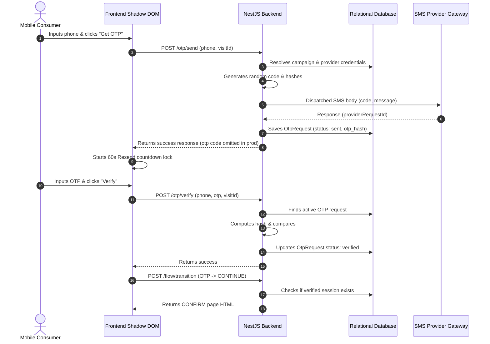
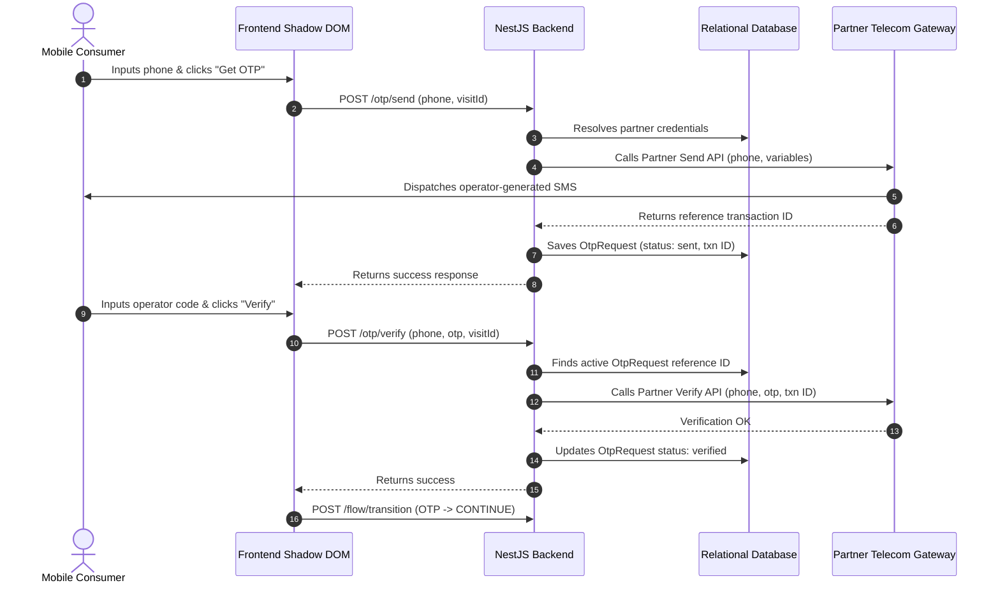

# OTP Sequence Diagrams

This document visually illustrates the transaction sequence flows.

## 1. Local OTP Flow (Twilio, MSG91, Kaleyra, Custom HTTP)

## 2. Partner API Flow (Telecom Operator OTP)

