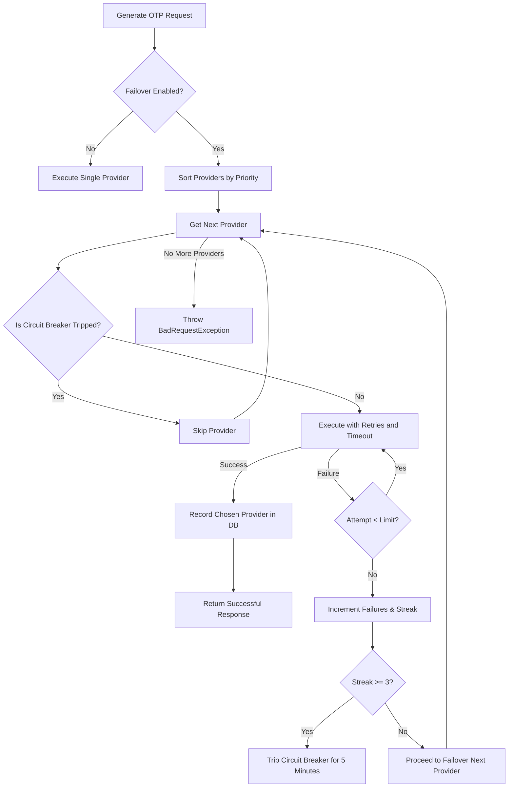

# Automatic OTP Provider Failover System

TemplateCraft implements an enterprise-grade distributed failover system for SMS/OTP gateways. This design protects public landing pages from single-point-of-failure (SPOF) outages.

---

## 1. Flow Diagram



---

## 2. Configuration Schema (`otpConfigJson`)

Marketers can configure failover parameters inside the visual dashboard via `otpConfigJson` on the campaign API configuration payload.

### Schema Spec
```json
{
  "failover": true,
  "providers": {
    "twilio": {
      "priority": 1,
      "retryCount": 2,
      "timeout": 3000,
      "config": {
        "accountSid": "ACxxxx",
        "authToken": "xxxx",
        "from": "+12345678"
      }
    },
    "msg91": {
      "priority": 2,
      "retryCount": 2,
      "timeout": 4000,
      "config": {
        "authkey": "xxxx",
        "templateId": "xxxx"
      }
    }
  }
}
```

---

## 3. Circuit Breaker Mechanics

The gateway circuit breaker maintains state dynamically in memory:
- **Failure Threshold**: After **3 consecutive failed dispatches** (exceptions or returned errors), the gateway's circuit transitions to the `Tripped` state.
- **Cooldown Period**: A tripped gateway is blacklisted for **5 minutes** (`300000ms`).
- **Half-Open Recovery**: When a request occurs after the 5-minute cooldown, the gateway transitions to a half-open state. If it succeeds, the circuit returns to the `Closed (Healthy)` state; if it fails, it is tripped again.

---

## 4. Dashboard Metrics

The [OTP Analytics Dashboard](file:///d:/dddd/frontend/src/pages/OtpAnalyticsPage.jsx) exposes live status metrics:
- **Circuit State**: Renders as `CLOSED (HEALTHY)` or `TRIPPED` in red glowing badges.
- **Latency Tracking**: Displays average response times (in ms) calculated over the last 50 requests.
- **Live success rates**.
