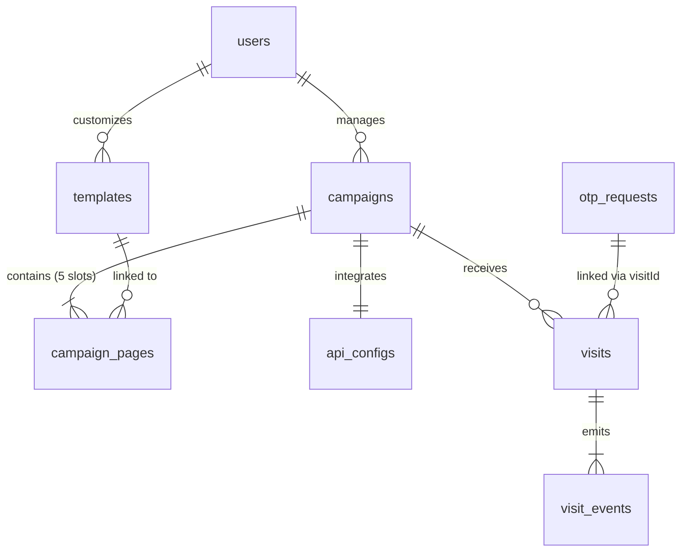

# Database Schema & Entity Relationships

TemplateCraft uses TypeORM to manage schemas. It supports both MySQL (default configured in `.env`) and PostgreSQL databases dynamically. 

---

## 1. Relational Entity Diagram

---

## 2. Table Specifications

### 2.1 Users (`users`)
Stores administrative user accounts with access to the dashboard.
- **`id`** (`int`, PK, Auto-increment)
- **`email`** (`varchar`, Unique, Indexed)
- **`password`** (`varchar`) — BCrypt hashed password
- **`name`** (`varchar`)
- **`avatar`** (`varchar`, Nullable)
- **`created_at`** (`datetime` / `timestamp`)
- **`updated_at`** (`datetime` / `timestamp`)

### 2.2 Templates (`templates`)
Stores page design structures. Designs can be prebuilt/seeded or customized.
- **`id`** (`int`, PK, Auto-increment)
- **`name`** (`varchar`)
- **`data`** (`json`) — Holds components HTML, CSS styles, and GrapesJS editor state
- **`user_id`** (`int`, FK, Nullable) — Link to creator, null for global prebuilt templates
- **`is_prebuilt`** (`boolean`, Default `false`)
- **`created_at`** (`datetime` / `timestamp`)
- **`updated_at`** (`datetime` / `timestamp`)

### 2.3 Campaigns (`campaigns`)
Marketing campaigns targeted to specific locations.
- **`id`** (`int`, PK, Auto-increment)
- **`name`** (`varchar`)
- **`country`** (`varchar`, Normalized, Case-insensitive match)
- **`operator`** (`varchar`, Normalized, Case-insensitive match)
- **`service_id`** (`varchar`, Nullable) — Used for subscription billing identifier
- **`active`** (`boolean`, Default `false`)
- **`user_id`** (`int`, FK, Not Null) — Links to owner in `users`
- **`created_at`** (`datetime` / `timestamp`)
- **`updated_at`** (`datetime` / `timestamp`)
- **Indexes**:
  - Unique compound index `IDX_CAMPAIGNS_COUNTRY_OPERATOR` on `(country, operator)`.
- **Foreign Keys**:
  - `user_id` references `users(id)` ON DELETE CASCADE.

### 2.4 Campaign Pages (`campaign_pages`)
Binds specific templates to page slots in a campaign's subscription flow.
- **`id`** (`int`, PK, Auto-increment)
- **`campaign_id`** (`int`, FK)
- **`page_type`** (`varchar`) — Must be one of: `HOME`, `CONFIRM`, `OTP`, `THANKYOU`, `BLOCKED`, `ERROR`
- **`template_id`** (`int`, FK, Nullable)
- **`created_at`** (`datetime` / `timestamp`)
- **`updated_at`** (`datetime` / `timestamp`)
- **Indexes**:
  - Unique compound index `IDX_CAMPAIGN_PAGES_TYPE` on `(campaign_id, page_type)`.
- **Foreign Keys**:
  - `campaign_id` references `campaigns(id)` ON DELETE CASCADE.
  - `template_id` references `templates(id)` ON DELETE SET NULL.

### 2.5 API Configurations (`api_configs`)
Stores dynamic API links for partner integrations for each campaign.
- **`id`** (`int`, PK, Auto-increment)
- **`campaign_id`** (`int`, FK, Unique) — One configuration per campaign
- **`user_api`** (`varchar`, Nullable)
- **`blocklist_api`** (`varchar`, Nullable) — Endpoint to check if number is blocklisted/DND
- **`subscription_api`** (`varchar`, Nullable) — Endpoint to check active billing status
- **`subscribe_api`** (`varchar`, Nullable) — Endpoint to request new billing setup
- **`headers_json`** (`text`, Nullable) — Holds HTTP header configurations as JSON string
- **`otp_provider`** (`varchar(32)`, Nullable) — SMS OTP gateway provider (twilio, msg91, kaleyra, partner, custom_http, local)
- **`otp_config_json`** (`text`, Nullable) — Serialized configurations (API keys, templates, sender IDs, custom endpoints)
- **`created_at`** (`datetime` / `timestamp`)
- **`updated_at`** (`datetime` / `timestamp`)
- **Foreign Keys**:
- `campaign_id` references `campaigns(id)` ON DELETE CASCADE.

### 2.6 Visits (`visits`)
Records unique customer click sessions.
- **`id`** (`int`, PK, Auto-increment)
- **`campaign_id`** (`int`, FK, Nullable)
- **`phone`** (`varchar`, Nullable)
- **`country`** (`varchar`, Nullable)
- **`operator`** (`varchar`, Nullable)
- **`ip_address`** (`varchar`, Nullable)
- **`user_agent`** (`varchar`, Nullable)
- **`landing_url`** (`text`, Nullable)
- **`visit_status`** (`varchar`, Default `VISIT`) — Funnel state: `VISIT`, `BLOCKED`, `SUBSCRIBED`, `PLAN_SHOWN`, `HOME_SHOWN`, `CONFIRM_SHOWN`, `SUCCESS`, `FAILED`
- **`page_type`** (`varchar`, Nullable) — Current page the user is viewing
- **`created_at`** (`datetime` / `timestamp`)
- **`updated_at`** (`datetime` / `timestamp`)
- **Indexes**:
  - `IDX_VISITS_CAMPAIGN` on `(campaign_id)`.

### 2.7 Visit Events (`visit_events`)
High-frequency transactional funnel telemetry logs.
- **`id`** (`int`, PK, Auto-increment)
- **`visit_id`** (`int`, FK)
- **`event_type`** (`varchar`) — Core funnel metrics: `VISIT`, `BLOCKED`, `PLAN_VIEW`, `HOME_VIEW`, `CONFIRM_VIEW`, `SUBSCRIBE_CLICK`, `SUBSCRIBE_SUCCESS`, `SUBSCRIBE_FAILED`
- **`metadata`** (`json`, Nullable) — Stores diagnostic logs, block reasons, etc.
- **`created_at`** (`datetime` / `timestamp`)
- **Foreign Keys**:
  - `visit_id` references `visits(id)` ON DELETE CASCADE.
- **Indexes**:
  - `IDX_EVENTS_VISIT` on `(visit_id)`.

### 2.8 OTP Requests (`otp_requests`)
Validation codes generated for subscription security validation.
- **`id`** (`int`, PK, Auto-increment)
- **`visit_id`** (`int`, Nullable) — Link to visit record
- **`campaign_id`** (`int`, Nullable) — Link to campaign record
- **`phone`** (`varchar(32)`) — Mobile phone number
- **`otp_hash`** (`varchar(255)`) — Salted sha256 code hash
- **`otp_salt`** (`varchar(64)`, Nullable) — Salt value used for crypt
- **`provider`** (`varchar(32)`, Nullable) — SMS provider used
- **`provider_request_id`** (`varchar(255)`, Nullable) — Third-party request ID reference
- **`status`** (`varchar(32)`) — 'sent', 'verified', 'failed'
- **`attempts`** (`int`, Default `0`) — Track verification attempts (Max 5)
- **`used_at`** (`datetime` / `timestamp`, Nullable) — Deprecated (backward compatibility)
- **`verified_at`** (`datetime` / `timestamp`, Nullable) — Timestamp when successfully verified
- **`expires_at`** (`datetime` / `timestamp`) — Token expiration limit (5 minutes)
- **`created_at`** (`datetime` / `timestamp`)
- **`updated_at`** (`datetime` / `timestamp`)
- **Indexes**:
  - `IDX_OTP_PHONE_CREATED` on `(phone, created_at)`.
